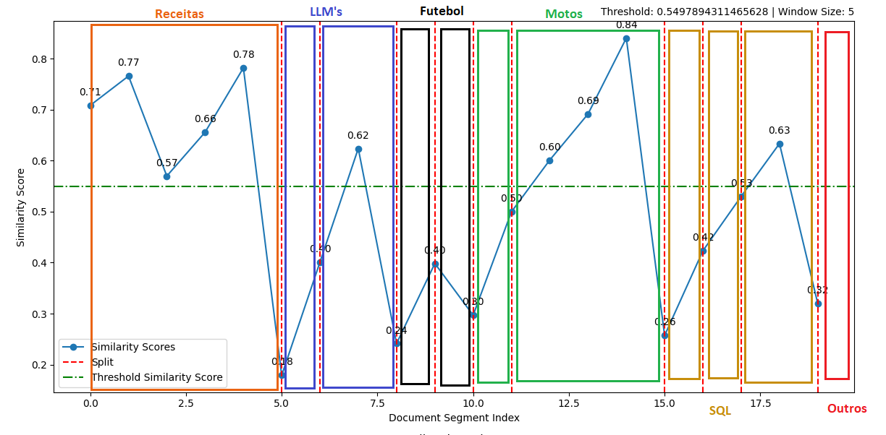

# chunk-strategies-for-rag
## 1. Fixed size chunking:
divide o texto de acordo com um numero pré definido de caracteres.

**Exemplo:**

```palintext

"Machine learning é uma área da inteligência artificial que permite que sistemas aprendam e façam previsões a partir de dados."

Dividindo em chunks de 20 caracteres:
1. "Machine learning é um"
2. "a área da inteligênc"
3. "ia artificial que pe"
4. "rmite que sistemas a" 
```
## 2. Recursive chunking
divide o texto de acordo com pontuações (exemplos: '.', ':', '!', '?', )

```palintext
"A análise de dados é essencial. Ela permite identificar padrões. Pode revelar insights profundos!"

Chunks:
1. "A análise de dados é essencial."
2. "Ela permite identificar padrões."
3. "Pode revelar insights profundos!"
```


## 3. Recursive character chunking
Similar ao chunk de tamanho fixo, porém há uma sobreposição de caracteres caso haja necessidade, onde um chunk pode iniciar com os ultimos 'n' caracteres do chunk anterior.

**Exemplo:**

```
"A segmentação de texto facilita a análise e compreensão."

Dividindo em chunks de 20 caracteres com uma sobreposição de 5 caracteres:
1. "A segmentação de text"
2. "de texto facilita a a"
3. "cilita a análise e co"
```

## 4. Semantic chunking 
Divide o texto de acordo com base na semântica e significado, utiliza modelo de embeddings para tal, e cria divisões onde há uma mudança de idéia ou contexto.

**Exemplo utilizado no código:**
.png)


O mais interessante no uso dessa biblioteca específica para o chunk semântico, é a possibilidade de visualizar graficamente e obter as estatísticas a respeito do seu conjunto de dados.

Interessante observar que neste uso, os diferentes assuntos,mesmo que os diferentes assuntos nem sempre fiquem totalmente agrupados em um único chunk, não há mistura de temas entre eles.

Os textos a respeito de LLM's, não permaneceram 100% unidos, mas não houve mistura com textos a respeito de futebol.


O visual desse gráfico pode parecer confuso de primeira, mas para explica-lo melhor eu diferenciei por cores, os assuntos distintos.

A linha **azul**, indica a similaridade e coerência de um texto com o outro.

A linha **verde** indica o limite minimo de coerência ideal, e sempre que a linha de sililaridade está abaixo do ideal, há uma divisão de texto.

A linha **vermelha** indica justamente, entre quais textos foi realizado a divisão(chunk)




